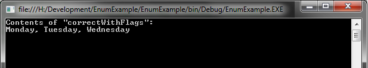
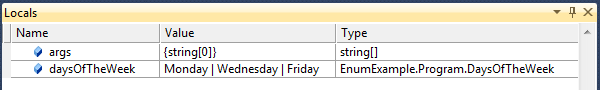

# Introduction
Everyone learns about enumeration when they start developing in C#.NET. It is a very simply structure that can be used to solve a wide range of problems. One of the best uses for enumeration is using them as a flag. In the .NET Framework, there is a handy attribute you specify on your enumeration called `Flags` and now your enumeration will work as a flag. Or so you thought.

The reality is there is work you need to do to make the enumeration to function like a flag. I have seen experienced .NET developers get caught up working under the assumption that `Flags` handles everything for you. I personally think the reason for this is due to the documentation surrounding enumeration and flags. It seems to me the MSDN documentation on enumeration fails to explain how enumeration and flags work which causes a misunderstanding at implementation time.

In this article, I will explain what an enumeration is, what are flags, and how to make enumeration operate like a flag.

# Background
A few months ago (from when this article was written), I was trying to recall a technique (which I will go over in this article) for setting up enumeration as flags. So I fired up my trusty web browser and brought up Google and searched for "enum flags". You get a little over two million results back and naturally, the first few are MSDN documentation pages. As I was hunting for the article that had the technique I wanted, I became increasingly frustrated with the mixed content and descriptions as to how enumeration and flags work. I got so frustrated between the authors and the comments people were leaving, I decided to set out and write an 'end all be all' solution to this problem.

Also, this is my first article, so be kind when you leave comments and feedback.

# What is enumeration?
Enumeration is basically a list of possible values for a variable. The easiest way to apply them is to think of the days of the week. Typically, Sunday is considered to be the first day of the week and Saturday as the last day of the week. So if we assign a numerical value to the days of the week, you get the following: Sunday = 1, Monday = 2, Tuesday = 3, Wednesday = 4, Thursday = 5, Friday = 6, and Saturday = 7. So in our program, we can use these numerical values for the day of the week as opposed to the string value. This removes issues related with string comparison (case issues, which space, special characters, etc.), and it also allows us to save memory and processing time. I know in today's world, memory usage and CPU usage are not a huge issue versus twenty years ago, but that doesn't give us the excuse to be lazy or design poorly.

In the C#.NET world, we use the keyword `enum` to define an enumeration. If we use the day of the week example from above, we would see something like this:

``` csharp
enum DayOfTheWeek
{
    Sunday = 1,
    Monday = 2,
    Tuesday = 3,
    Wednesday = 4,
    Thursday = 5,
    Friday = 6,
    Saturday = 7,
}
```

The MSDN reference describes more ways and styles of defining an enumeration. I would suggest checking out the [enum (C# Reference)](http://msdn.microsoft.com/en-us/library/sbbt4032(v=VS.100).aspx) for more details if you are new to enumeration.

# What are flags?
The idea of flags is to take an enumeration variable and allow it hold multiple values. If we continue with our days of the week example, think of a scheduling application. You want to set up a meeting for Monday, Wednesday, and Friday. The way we previously defined our enumeration, we would need seven `DayOfTheWeek` variables defined or create a list of `DayOfTheWeek` in order to store the days a meeting could be scheduled.

If we change the way we defined our enumeration to support the use of flags, we could avoid adding seven variables or adding the overhead of a list. This is where life gets confusing. A lot of people believe that simply adding the `Flags` attribute to the enumeration will take care of this. That is not the case. To properly implement an enumeration as a flag, you need to have the values increasing by a power of two. So if we define our enumeration to do this, we would get the following:

``` csharp
[Flags]
enum DaysOfTheWeek
{
    Sunday = 1,
    Monday = 2,
    Tuesday = 4,
    Wednesday = 8,
    Thursday = 16,
    Friday = 32,
    Saturday = 64
}
```

# The Why and the How
So it is at this point, a lot of people get confused. Let us start off by understanding at a binary level, what is going on.

| **Day of the Week** | **Decimal Value** | **Binary Value** |
| ------------------- | ----------------- | ---------------- |
| Sunday    | 1   | 0000001 |
| Monday    | 2   | 0000010 |
| Tuesday   | 4   | 0000100 |
| Wednesday | 8   | 0001000 |
| Thursday  | 16  | 0010000 |
| Friday    | 32  | 0100000 |
| Saturday  | 64  | 1000000 |

What you see here, at a binary level, is a left shift of bits. This is a critical component to flags and how we work with them.

Now let us take a look at how we assign values to them. Consider the following code snippet:

``` csharp
DaysOfTheWeek daysOfTheWeek;
daysOfTheWeek = DaysOfTheWeek.Monday | DaysOfTheWeek.Wednesday | DaysOfTheWeek.Friday;
```

What we have just done here is assigned Monday, Wednesday, and Friday to the variable `daysOfTheWeek`. We did this by using an OR operator. Let us look at the binary level again and see what happened.

|             |      |      |      |      |      |      |      |
| ----------- | ---- | ---- | ---- | ---- | ---- | ---- | ---- |
| `Monday`    | 0    | 0    | 0    | 0    | 0    | 1    | 0    |
|             | `\|` | `\|` | `\|` | `\|` | `\|` | `\|` | `\|` |
| `Wednesday` | 0    | 0    | 0    | 1    | 0    | 0    | 0    |
|             | `\|` | `\|` | `\|` | `\|` | `\|` | `\|` | `\|` |
| `Friday`    | 0    | 1    | 0    | 0    | 0    | 0    | 0    |
|             |      |      |      |      |      |      |      |
| Result      | 0    | 1    | 0    | 1    | 0    | 1    | 0    |

Take note of the result. Remember that the single pipe, "|", in C# is a logic operator, not conditional. This means at a binary level, we OR each position of the binary values. Boolean logic tells us in an OR situation the result is true when at least one condition is true; otherwise the result is false. What you should begin to see now is that we are using each position of the binary value as a switch or flag to indicate when a day of the week has been selected.

To test to see if our result value has a specific flag set, we would use the following syntax:

``` csharp
if((daysOfTheWeek & DaysOfTheWeek.Monday) == DaysOfTheWeek.Monday)
{
    // Contains Monday!
}
else
{
    // DOES NOT Contain Monday!
}
```

Before we did a logical OR to combine the flags to store them into a single variable. Now we use the logical AND operator, "&", to test for the value. Let us look at the binary level to see what happened.

|                 |     |     |     |     |     |     |     |
| --------------- | --- | --- | --- | --- | --- | --- | --- |
| `daysOfTheWeek` | 0   | 1   | 0   | 1   | 0   | 1   | 0   |
|                 | `&` | `&` | `&` | `&` | `&` | `&` | `&` |
| `Monday`        | 0   | 0   | 0   | 0   | 0   | 1   | 0   |
|                 |     |     |     |     |     |     |     |
| Result          | 0   | 0   | 0   | 0   | 0   | 1   | 0   |

Notice that the result is the same as the value for Monday. So when our `if` statement is evaluated, it returns true. Sure enough, we added Monday to the enumeration. You are probably wondering how that happened, so let me explain it.

Remember that we are doing a logical AND operation. All of the conditions must be true in order to return a true. By AND-ing the value for Monday and `daysOfTheWeek`, we essentially are seeing if the position used for signaling Monday is set to true or not. If `daysOfTheWeek` contains Monday (and in this case it does), the AND operation will return the value for just Monday. We then do a conditional comparison to the value of Monday. The logic can be applied to any day of the week you wish to check for. If `daysOfTheWeek` does not contain the day you are looking for, the result will be 0 and your conditional check will be false.

# So what does the Flags attribute do?
So now that we understand the how and the why, people assume that the `Flags` attribute sets up the values accordingly for you. The actual job of the attribute is for readability purposes when debugging or writing the values to a console or a file.

``` csharp
// Writes the following to the console window: Monday, Wednesday, Friday
Console.WriteLine(daysOfTheWeek);
```





# A Neat Trick
Depending on the size of your enumeration, the exponential increase in values can get tricky to keep track of or calculate in your head. There is a technique in C# that will make this far more manageable, and it is an old one at that.

``` csharp
[Flags]
enum DaysOfTheWeek
{
    Sunday = 1,
    Monday = 1 << 1,
    Tuesday = 1 << 2,
    Wednesday = 1 << 3,
    Thursday = 1 << 4,
    Friday = 1 << 5,
    Saturday = 1 << 6,
}
```

Through the use of bit shifting, we can move the 1 bit sequentially without having to worry about the actual integer value. From a readability stand point, I prefer this. If you get into the habit of thinking of flags as a series of bit switches, this allows to see which bit switch you turned on for a specific value. There is nothing that requires you to do this, but it is a neat trick that I like using which I thought would be worth sharing in this article.

For more information on this trick, check out the [<< Operator (C# Reference)](http://msdn.microsoft.com/en-us/library/a1sway8w(v=VS.100).aspx) article in the MSDN library.


# The New HasFlag Method

A lot of people have left me comments about me not mentioning this method. When I originally wrote this, .NET 4.0 was in beta, so this method wasn't available yet. Now that we have .NET 4.0 and .NET 4.5, I can add it to the article now.

With the release of .NET 4.0, developers found a new method to handle the "dirty work" of checking to see if a an `enum` has a flag. **Every** `enum` instance now has this method and you simply pass into the flag value you want to check for.

``` csharp
if(daysOfTheWeek.HasFlag(DaysOfTheWeek.Monday))
{
    // Contains Monday!
}
else
{
    // DOES NOT Contain Monday!
}
```

Noticed how I made "every" bold? Regardless of how you are using the `enum` or how it is setup, this method will always be there. While this does clean up our code and makes easier to understand, we should note two things.

The first thing we should note is that the method will not work as expected without properly setting up your `enum` with the correct values. I've updated the sample code for the project to reflect this as well. Under the hood, the method is doing the same thing you would have done by hand.

One last thing to take away (and this a personal perspective) is abstraction can be very helpful but dangerous at the same time. There are a lot of powerful features beign built into the C# language and .NET itself. Microsoft has been working hard to improve the quality of life for developers, but with that comes a cost. It becomes increasingly more important to understand how things work under the hood or understand how something is implemented. I'm not saying you need to be an expert on system internals, but you should know how something works at high level so that when something goes wrong, you know how to troubleshoot it.