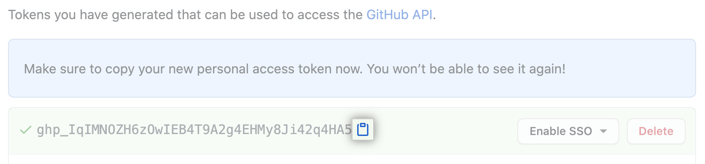

# Getting Started with NuGet on GitHub
The concept of a package manager in software development is not a new concept.
During the early days of .NET, developers struggled with sharing code and dependencies.
The language and framework was still very immature but gaining popularity fast.
As new version of the framework came out, we saw performance increases, new functionality, new abilities added to the languages, but no package management.
That is, until January 7th, 2011, when the first packages was published to NuGet.
Early adoption was slow, but soon it took off as the community realized the power and problems it solved (while, admittly, introducing a new set of problems).

Fast forward to today, developers and enterprise organizations not only can leverage community NuGet packages but they can also host their own internal NuGet packages.
Allowing teams to share their code with each other in a manner that has become second nature to .NET developers.

While the GitHub documentation does a good job at getting you up and running, it does not do a good job at explaining how to make this sustainable.
During my exploration of this topic, I noticed a lot of blog posts that essentially follow the GitHub documentation.
This is a concern for me since those writings are not helping teams make this a sustainable pattern.
My mission with this post is to not only help you get started with using GitHub Packages, but to set you up for long term success.

# Starting with Security
Security is obviously a hot topic and needs to be the starting point.
We are going to start sharing code and depending on the use case, we need to understand who will have access to the packages we make.

When using GitHub Packages as a NuGet registry, the packages are stored with the repository.
This is important because it determines who can see and consume this package in the first place.
Published NuGet packages use repository-scoped permissions in GitHub.
This means that in order for someone to consume a NuGet package, they need to have at a minimum read access to the repository.
It is also worth noting that public repositories allow anyone to access the packages.

## Authenticating to GitHub Packages
Now that we understand who can access the packages, we need to be able to authenticate against GitHub Packages to be able to consume them.
A lot of open source and paid commercial solutions allow for LDAP, NTLM, and/or OAuth authentication where as GitHub Packages only supports a Personal Access Token (PAT).
I will admit, this experience is not the best, but given the simplicity of getting up and running with GitHub Packages, tradeoffs are bound to happen.
Don't let this discourage you as the experience isn't bad (as you will see shortly), it just may not be the exact solution you are looking.

The first step is to generate a personal access tokn.
You can do this by logging into your GitHub account and going to "Settings -> Developer Settings -> Personal Access Tokens" ([Creating a personal access token][creating-a-personal-access-token]).
Next, we need to decide what scope to grant this token.
While it may be easy to simply grant all scopes, I'm a firm believer in scoping tokens to have the exact permissions needed to get the job done.
The below table will help us to figure out the permissions needed.

| Scope             | Description                                           | Required Repo Permission |
| ----------------- | ----------------------------------------------------- | ------------------------ |
| `read:packages`   | Download packages from the registry                   | read                     |
| `write:packages`  | Upload and publish packages to the registry           | write                    |
| `delete:packages` | Delete packages from the registry                     | admin                    |
| `repo`            | All of the above, plus full control over repositories | read, write, or admin    |

The *Scope* defines what the PAT is *allowed* to do.
So if you have the PAT with the `read:packages` scope, the most it can do is read packages in the registry.
You won't be able to use it to delete a packge or publish a package as it will give you a permissions error.
In order for the `read:packages` scope to read a package in the first place, you need to have (at a minimum) read permissions of the reopository that has the package.

If you create a PAT with just the `write:packages` scope selected, you need to have (at a minimum) write permissions to the repository.
However, if you try to use this PAT to read a package, it will fail.
The PAT is not scoped to read __and__ write packages, just write.
How you want to use this PAT will dictate what scopes you will need to select.
Later on, I'll discussion some best practices on managing PATs with regards to GitHub Packages.

Once you have selected the appropriate scopes, click "Generate token".
This will take you back to the list of PATs you have and you will see a box with the new token.
You will see a copy button next to it, make sure you click it highlight the token and copy it.
This will be your only oppourtunity to get the token.
Once you leave this screen, the plain text token will be gone and you will either need to regenerate it or delete it and start again.



One last thing to note when using PATs.
If your GitHub Organization(s) are integrated with SAML single sign-on, you will need to one extra step.
Notice the "Enable SSO" button in the screenshot above.
This is to allow you to use the token with organizations that have SSO enabled.
For more information, please read [Authorizing a personal access token for use with SAML single sign-on][authorizing-pat-single-sign-on].

# Adding the GitHub NuGet Registry
With your PAT in hand, now we can add the NuGet registry to our local machine to support development work.
Most people will simply add this to a `nuget.config` file in their repository.
The first issue I have with this is it adds a secret to your repository which is dangerous and bad practice.
Second, it forces developers to share the same PAT which means it is hard to restrict access (when necessary) and audit/track suspicious activity.
So let us add the source in a way that will not make matters worse for us using a CLI tool.
The prefered way is to use the .NET CLI (`dotnet`), but the NuGet CLI is still valid.

### .NET CLI
```
dotnet nuget add source --username USERNAME --password GITHUB_PAT --name github "https://nuget.pkg.github.com/OWNER/index.json"
```
*Note: Non-Windows users will need to add the flag `--store-password-in-clear-text` as encrypted passwords are not supported outside of Windows at the time of this writing.

### NuGet CLI
```
nuget sources Add -UserName USERNAME -Password GITHUB_PAT -Name "github" -Source "https://nuget.pkg.github.com/OWNER/index.json"
```

Let's take a moment to break this command down.
First, this will command will add a new source to your [global NuGet configuration][common-nuget-configurations].
It will use the `name` argument to give it a way for you to identify it tools such as Visual Studio.
The `username` and `password` arguments specificy the credentials being use to connect to the registry.
At the time of this writing, the user name is essentially ignored by GitHub so you can leave it as "USERNAME" or put your GitHub handle in it's place.
I prefer to use the GitHub handle as it can help you remember what identity the PAT is tied too in the event you are managing multiple identities.
The `password` arugment needs to be your PAT that you want to authenticate with.
The `source` argument (which is position implied with the `dotnet` command) is the URL of the registry feed.
```
https://nuget.pkg.github.com/OWNER/index.json
```
These are well-known URLs to make use of your registry, simply replace the `OWNER` portion of the URL with the owner of the repository that **published** the NuGet package.
In the enterprise setting, this will be your GitHub organization.
If you run multiple orgnanizations in your enterprise, you may need to add a source for each organzation that contains NuGet packages you want to consume.

<!-- Links -->
[creating-a-personal-access-token]: https://docs.github.com/en/authentication/keeping-your-account-and-data-secure/creating-a-personal-access-token
[authorizing-pat-single-sign-on]: https://docs.github.com/en/enterprise-cloud@latest/authentication/authenticating-with-saml-single-sign-on/authorizing-a-personal-access-token-for-use-with-saml-single-sign-on
[common-nuget-configurations]: https://learn.microsoft.com/en-us/nuget/consume-packages/configuring-nuget-behavior